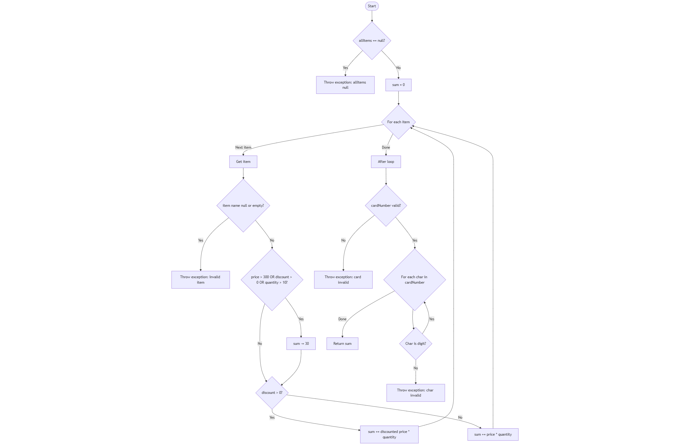

Михаил Наумов 233194

## 2. CFG

## 3. Цикломатска комплексност
  Формулата за ЦК е: `E-N+2*P`, каде:
  E=број на рабови, N=број на јазли, P=број на поврзани компоненти.
  Имаме:
  E=28;
  N=21;
  P=1 (бидејќи имаме само една функција).
  Кога ќе ги искористиме овие вредности во формулата:
  `M=E-N+2*P` => М=28-21+2 => M=7+2 ==> M=9 

## 4. Every statement критериумот значи дека секој израз во кодот треба да се изврши барем еднаш.
Во овој случај, потребни се минимум 8 тест примери.
Пример тест примери:
  1. allitems is null - цел е да се направи null check и ако е null, се фрла исклучок "allItems can't be null", а ако не е null, се продолжува со извршувањето програмата.
  2. item name is null/empty - цел е да се валидира името на некој предмет, ако нема име или е null, се фрла исклучок "Invalid item!".
  3. item price > 300 - се тестира условот за цена, ако е исполнет да се изврши попуст на цената и се прави sum-=30.
  4. item discount > 0 - се калкулира цената на попустот, за да се направи sum-=30.
  5. item quantity > 10 - ако е исполнет овој услов, исто се прави sum-=30.
  6. обичен предмет тест (без попуст, со помала цена од 300, со помала количина од 10 предмети) - се тестира обичната пресметка без горните попусти/дедукции.
  7. невалиден број на картичка (null или грешка должина) - ако е null или со грешка должина должината на бројките на картичката, тогаш се фрла исклучок "Card Invalid", а во спротивен случај си продолжува програмата со извршување.
  8. се проверува валидноста на карактерите во картичката - ако некој карактер не е бројка, се фрла исклучок "Invalid character in card number", ако е се како што треба после јамката се враќа сумата.

## 5. Потребни се 4 тест примери за целосна препокриеност на овој ИЛИ услов.
  Може да го поделиме условот на три делови:
    1. item.getPrice() > 300;
    2. item.getDiscount() > 0;
    3. item.getQuantity() > 10.

  Првиот тест би бил сите услови да се грешка. Тоа значи првиот да е под или еднаков на 300, вториот да е под или еднаков на 0, третиот да е под или еднаков на 10, со ова треба да падне условот и да нема дедуцирање на сумата.
  Вториот тест би бил само цената да е над 300,а другите услови да бидат грешни. Вака треба да имаме дедуцирање на сумата.
  Третиот тест би бил само ако discount > 0 е точно, а другите услови се неточни. Според ова, треба да имаме дедуцирање на сумата.
  Четвртиот и последниот тест е само ако quantity > 10 е точно, а другите услови се неточни. Па, така според ова треба да имаме дедуцирање на сумата.

## 7. Објаснување за unit тестовите за секој од критериумите.
  Двете функции ми се: testCheckCartBranchCoverage() и testCheckCartDiscounts(). 
  За првата функција, напишав unit тестови во кои проверувам секоја гранка во checkCart функцијата да е извршена барем еднаш. Односно, за секој if услов и можен исклучок, имам тест кој го тестира тоа. 
  Креирав тестови за:
    -allItems да не смее да биде null;
    -невалиден предмет;
    -невалидна должина на бројот на картичката;
    -невалиден карактер во бројот на картичката;
    -валиден предмет и валиден број.
  Потоа, во втората функција, ги проверувам условите поединечно. За условот (item.price > 300 || item.discount > 0 || item.quantity > 10), го поделив на три дела и поединечно секој дел го тестирав, односно:
  -ако само item.price > 300 е точно;
  -ако само item.discount > 0 е точно;
  -ако само item.quantity > 10 е точно;
  -или сите се неточни.
    
